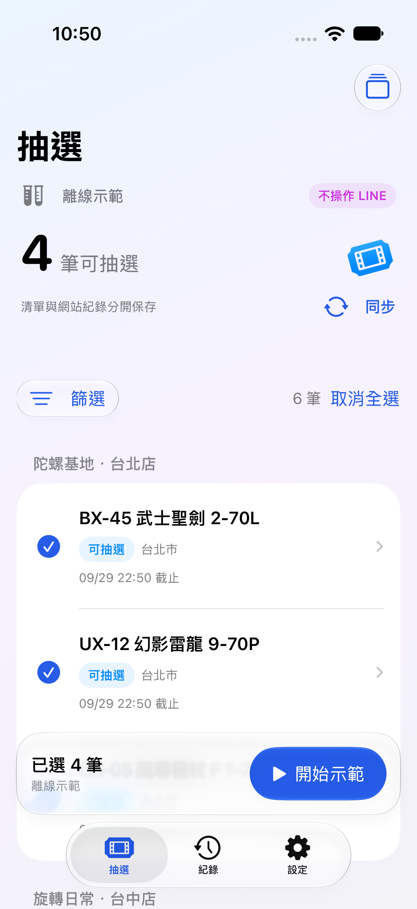
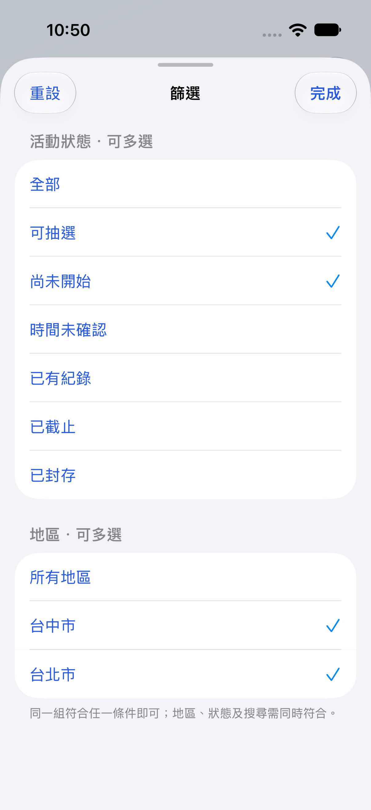
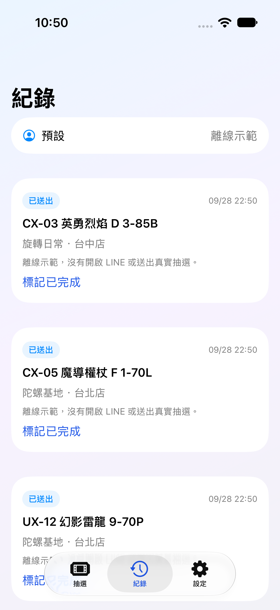

# LineDraw iOS

原生 iPhone LINE 抽選工具，採 SwiftUI 與 iOS 27 Liquid Glass。同步活動清單、依地區與狀態多選篩選、依序抽選，並在手機保存參加紀錄。**LineDraw 無網站登入、無 VIP 驗證；LINE 本身仍須先登入。**

目前版本：**1.1.0（build 17），實驗版本**。教學更新：**2026/10/02**。自有程式碼採 **PolyForm Noncommercial 1.0.0**，限非商業使用；第三方元件保留各自授權。

build 17 修正原站混入「上架販售、沒有抽選連結」商品造成整份清單解析失敗，並新增 **Funbox 原站／陀螺獵人** 來源切換。來源、清單快取與同步時間會保存；同一張券共用完成紀錄。手機自主模式與新版 Mac 輔助程式均依所選來源接續。詳見[來源更新與驗證](ios-app/docs/CATALOG_SOURCES_BUILD17_2026-10-02.md)。

build 16 修正系統進度遮住關閉鈕而停止的問題：抽選指令成功回應並保存紀錄後，直接開下一筆網址，不再關閉舊券或收合動態島。詳見[修正與實機驗證](ios-app/docs/DIRECT_LINK_BUILD16_2026-10-02.md)。

<p>
  
  
  
</p>

以上為歷史版本的離線示範畫面，不是真實中獎紀錄。

## 完整教學目錄

1. [先了解安裝範圍與必要條件](#requirements)
2. [下載、安裝與設定 Xcode](#xcode)
3. [安裝 Homebrew、Node.js、Ruby、Python 與 Rust](#tools)
4. [下載 LineDraw 原始碼](#source)
5. [登入 Apple Account、連接 iPhone、開啟開發者模式](#apple-account)
6. [設定自己的 App 與 Runner 識別碼](#identifiers)
7. [編譯、簽名並安裝 LineDraw App](#build-app)
8. [編譯、簽名並安裝 DeviceRunner](#build-runner)
9. [在 iPhone 下載及開啟 LocalDevVPN](#localdevvpn)
10. [第一次在手機配對](#phone-pairing)
11. [自動準備 DDI 與檢查啟動](#startup-check)
12. [日常同步、篩選與自動抽選](#daily-use)
13. [五連結測試、離線示範與匯入清單](#testing)
14. [紀錄、手動完成、帳號切換與診斷](#records)
15. [重開機、更新與免費帳號續簽](#maintenance)
16. [常見問題與排除方式](#troubleshooting)
17. [選用：Mac 輔助模式](#mac-mode)
18. [驗證範圍、原始碼與授權](#project-info)

<a id="requirements"></a>

## 1. 先了解安裝範圍與必要條件

本教學以 **Mac 首次建置與簽署安裝 → iPhone 自行配對 → 日常只用手機抽選** 為主線。

| 階段 | 需要 Mac 嗎？ | 需要做的事 |
|---|---|---|
| 下載原始碼、編譯、簽署、首次安裝 | 本教學需要 | Xcode 安裝 LineDraw 與獨立 DeviceRunner |
| 手機配對、準備必要檔案 | 安裝完成後不需要 | iPhone 開啟 Wi-Fi／LocalDevVPN，在系統設定輸入 PIN |
| 日常抽選、重開機後重新啟動 | 簽章與環境仍有效時不需要 | 解鎖、恢復 Wi-Fi／VPN，從 LineDraw 手動開始 |
| 簽章到期、重新編譯或更新版本 | 本教學需要 | 回 Mac 重新簽署、覆蓋安裝 |

**日常免電腦，不代表免簽署、永久免續簽，或只安裝一個 App。** 手機會使用 LineDraw、DeviceRunner 與 LocalDevVPN；PIN 即時動態是附在 LineDraw 內的 extension，不需另外點開安裝。

準備以下項目：

| 項目 | 本版需求 |
|---|---|
| Mac | 建議 Apple Silicon（M 系列）；本專案的模擬器 bridge 只建置 arm64，Intel Mac 不屬於這份已驗證流程 |
| macOS／Xcode | Xcode 27；Apple 列出的 Xcode 27 最低 macOS 為 26.6，本專案實測使用 macOS 27／Xcode 27 |
| iPhone | 本版 App 部署目標是 iOS 27；其他版本／機型的相容性不保證 |
| Apple Account | 可使用免費 Personal Team；需自行登入及完成雙重認證 |
| 傳輸線 | 首次安裝時連接 Mac 與 iPhone，需可傳輸資料 |
| 網路 | Mac 能下載依賴；手機連 Wi-Fi，並能存取 LINE 與必要的 Apple 服務 |
| LINE | 已安裝，且手動確認登入的是預計抽選的帳號 |

Xcode 與 iOS 支援範圍會變動，安裝前請核對 [Apple Xcode 系統需求表](https://developer.apple.com/xcode/system-requirements)。不要因為 LocalDevVPN 支援較舊 iOS，就推論 LineDraw 也能在該版本執行。

**免費 Apple Account 的限制：** Apple 目前列出每部裝置最多安裝 3 個個人開發 App、最多登錄 10 個 App ID，佈建描述檔自核發起 7 天到期，之後需重新建置安裝。LineDraw 與 DeviceRunner 是兩個開發 App，extension 也需要自己的識別碼。若原本已有其他側載 App，請先留意額度；從 App Store 安裝的 LocalDevVPN 不使用這份個人開發簽署。詳見 [Apple Personal Team 說明](https://developer.apple.com/help/account/basics/about-your-developer-account)。

<a id="xcode"></a>

## 2. 下載、安裝與設定 Xcode

1. 在 Mac 開啟 [Mac App Store 的 Xcode](https://apps.apple.com/tw/app/xcode/id497799835?mt=12)，按「取得／安裝」。本教學以 Xcode 27 為準。
2. 若商店版本不符合需求，可從 [Apple Developer Downloads](https://developer.apple.com/download/all/?q=Xcode) 下載對應版本；該頁可能要求登入 Apple Account。下載 `.xip` 後解壓縮，將 Xcode 放到「應用程式」。
3. 第一次打開 Xcode，接受授權並依提示安裝必要元件。若詢問開發平台，選 iOS。下載與解壓需要較多空間，請預留數十 GB。
4. 在 Xcode → Settings → Locations，確認 Command Line Tools 選到 Xcode 27；Settings → Components 中若出現 iOS 平台元件下載需求，依提示完成。模擬器 runtime 是離線 UI 測試用，不能取代實機支援元件。
5. 打開 macOS「終端機」（Spotlight 搜尋 Terminal），檢查：

```sh
xcodebuild -version
xcode-select -p
```

應看到 Xcode 27，以及指向完整 Xcode 的路徑，例如 `/Applications/Xcode.app/Contents/Developer`。**只有 Command Line Tools 不足以建置本專案。** 若目前選到其他版本，在確定 Xcode 安裝位置後執行：

```sh
sudo xcode-select --switch /Applications/Xcode.app/Contents/Developer
sudo xcodebuild -runFirstLaunch
```

這會切換這部 Mac 使用的開發工具；若 Xcode 有其他檔名，請換成實際路徑。`sudo` 要求的是 Mac 使用者密碼，輸入時終端機不會顯示字元。

<a id="tools"></a>

## 3. 安裝建置工具

以下使用 macOS 預設 zsh。命令分段執行，每段成功後再繼續；若出現錯誤，先處理該段，不要直接跳到安裝手機。

### 3.1 Homebrew

已安裝者可用 `brew --version` 確認並略過安裝。未安裝者從 [Homebrew 官網](https://brew.sh/) 核對安裝指令：

```sh
/bin/bash -c "$(curl -fsSL https://raw.githubusercontent.com/Homebrew/install/HEAD/install.sh)"
```

照安裝器提示完成，並執行最後列出的 **Next steps**，讓 `brew` 加入 PATH。Apple Silicon 預設位於 `/opt/homebrew`；若目前終端機仍找不到它，可先執行：

```sh
eval "$(/opt/homebrew/bin/brew shellenv)"
brew --version
```

### 3.2 Node.js、Ruby 與 Python

```sh
brew install node@24 ruby python
export PATH="$(brew --prefix ruby)/bin:$(brew --prefix node@24)/bin:$PATH"
gem install xcodeproj

node --version
npm --version
ruby --version
python3 --version
ruby -rxcodeproj -e 'puts Xcodeproj::VERSION'
```

Node.js 需 24+、npm 需 10+。Ruby 的 `xcodeproj` 用來產生 Xcode 專案；使用上面 Homebrew Ruby，避免把套件裝到 macOS 系統 Ruby。套件來源：[Node.js 24](https://formulae.brew.sh/formula/node@24)、[Ruby](https://formulae.brew.sh/formula/ruby)。

`export PATH=...` 只影響目前終端機。若另外開新視窗，請重新執行這行，或自行將相同設定加到 `~/.zprofile`；否則 Runner 準備工具可能找不到剛安裝的 Ruby gem。

### 3.3 Rust

依 [Rust 官方安裝說明](https://rust-lang.org/tools/install/) 安裝 rustup，選預設 stable 工具鏈：

```sh
curl --proto '=https' --tlsv1.2 -sSf https://sh.rustup.rs | sh
. "$HOME/.cargo/env"
rustup --version
rustc --version
cargo --version
```

若已安裝較舊 Rust，可先執行 `rustup update stable`。後續 bridge 腳本會自行加入 iPhone 與 Apple Silicon 模擬器的 target，無需另找預編譯 XCFramework。

<a id="source"></a>

## 4. 下載 LineDraw 原始碼

建議使用 Git，之後較容易更新。以下會放到你家目錄下的 `Developer/LineDraw-iOS`：

```sh
mkdir -p "$HOME/Developer"
cd "$HOME/Developer"
git clone https://github.com/beybladehunter/LineDraw-iOS.git
cd LineDraw-iOS
export LINEDRAW_REPO="$PWD"
```

若該目錄已存在，請使用既有目錄或另選新位置，不要覆蓋。公開倉庫下載不需 GitHub 登入。

也可以在 [倉庫首頁](https://github.com/beybladehunter/LineDraw-iOS) 按 Code → Download ZIP，解壓縮後在終端機 `cd` 到包含 `ios-app`、`ios-wda` 的目錄，再執行 `export LINEDRAW_REPO="$PWD"`。ZIP 沒有 Git 歷史，後續不能直接 `git pull`。

後面的命令使用 `$LINEDRAW_REPO` 指向這份原始碼；若重開終端機，請先回到同一目錄再設定一次。

<a id="apple-account"></a>

## 5. 登入 Apple Account 與準備 iPhone

1. 打開 Xcode → Settings → Apple Accounts（部分介面顯示 Accounts），按 `+` 加入自己的 Apple Account，完成登入及雙重認證。
2. 免費帳號應出現自己的 **Personal Team**。若 Apple 要求同意開發者協議，依畫面完成；不需要把帳號密碼或驗證碼交給其他人。
3. 用傳輸線連接 iPhone，解鎖。在手機出現「信任這部電腦」時按信任並輸入手機密碼。
4. Xcode → Window → Devices and Simulators → Devices，選自己的 iPhone，等待 Preparing／配對／裝置支援準備完成。
5. iPhone「設定 → 隱私權與安全性 → 開發者模式」開啟，依提示重新啟動；重開後解鎖並確認「啟用」。若選項尚未出現，先完成上述 Xcode 裝置配對，再回設定查看。
6. 重新接上並解鎖手機。在 Devices and Simulators 記下 **Identifier（UDID）**，稍後建置 Runner 使用。不要把 UDID 放入公開 Issue 或 Git。

[Apple 開發者模式說明](https://developer.apple.com/documentation/xcode/enabling-developer-mode-on-a-device) 與 [實機執行說明](https://developer.apple.com/documentation/xcode/running-your-app-on-simulated-or-physical-devices) 可供對照。完成此步時，Xcode 應能選到這支手機，而不是只有模擬器。

<a id="identifiers"></a>

## 6. 設定自己的 App 與 Runner 識別碼

**首次自行簽署時，先完成這一步再編譯。** 倉庫內的 `com.beybladehunter.linedraw` 是專案預設前綴，其他 Team 不一定能註冊。請選自己的唯一英文前綴，例如將 `yourname` 換成自己的英文代號與數字，之後更新、續簽都沿用同一組。

以 `com.yourname.linedraw` 為格式範例，各元件應對應如下：

| 項目 | 識別碼格式 |
|---|---|
| LineDraw App | `com.yourname.linedraw.ios` |
| PIN 即時動態 extension | `com.yourname.linedraw.ios.PairingActivity` |
| UI test target | `com.yourname.linedraw.ios.uitests` |
| DeviceRunner target | `com.yourname.linedraw.DeviceRunner` |
| 手機實際啟動的 Runner | `com.yourname.linedraw.DeviceRunner.xctrunner` |
| 抽選背景工作 | `com.yourname.linedraw.ios.deviceBatch` |
| 配對背景工作 | `com.yourname.linedraw.ios.phonePairing` |

Runner target **不加** `.xctrunner`，App 尋找安裝好的 Runner 時**要加**。背景工作字串也須在 `Info.plist` 與 Swift 程式內一致，不能只改 Xcode 畫面上的 App ID。

下面的設定片段只改你下載的本機原始碼，不會登入 Apple 或建立憑證。**先修改第一行的 `yourname`**；保留範例值時會停止，避免大家誤用同一組 ID。適用於尚未自訂識別碼的新下載副本；既有安裝升級時不要更換前綴。

```sh
export LINEDRAW_BUNDLE_PREFIX='com.yourname.linedraw'
cd "$LINEDRAW_REPO"
python3 - <<'PY'
import os, re
from pathlib import Path

old = 'com.beybladehunter.linedraw'
new = os.environ['LINEDRAW_BUNDLE_PREFIX']
if new in (old, 'com.yourname.linedraw') or not re.fullmatch(r'[A-Za-z][A-Za-z0-9-]*(?:\.[A-Za-z][A-Za-z0-9-]*){2,}', new):
    raise SystemExit('請先將 LINEDRAW_BUNDLE_PREFIX 改成自己的唯一英文前綴。')
paths = [
    'ios-app/scripts/generate-project.rb',
    'ios-app/scripts/prepare-device-runner.py',
    'ios-app/App/DeviceRuntime.swift',
    'ios-app/App/PhonePairing.swift',
    'ios-app/App/Info.plist',
    'ios-app/App/CompanionClient.swift',
]
changes = []
for name in paths:
    path = Path(name)
    text = path.read_text()
    if old not in text:
        raise SystemExit(f'{name} 已自訂或格式不同；請人工核對，未寫入任何檔案。')
    changes.append((path, text.replace(old, new)))
for path, text in changes:
    path.write_text(text)
    print('已更新', path)
print('完成。請保存這組前綴，續簽與更新時沿用。')
PY
```

這同時保持 App／extension／Runner、背景工作及本機 Keychain 服務名稱一致。這些是本機簽署自訂值，不需要回傳給倉庫維護者。重新產生 Xcode 專案會使用自訂後的產生器；只在 Xcode 裡改值，可能在下次產生專案時被覆蓋。

<a id="build-app"></a>

## 7. 編譯、簽名並安裝 LineDraw App

### 7.1 建置 bridge 並產生專案

```sh
cd "$LINEDRAW_REPO/ios-app"
bash scripts/build-device-bridge.sh
ruby scripts/generate-project.rb
open LineDraw.xcodeproj
```

首次建置需下載 Rust 依賴，可能花數分鐘。成功後會產生 `.runtime/LineDrawDeviceBridge.xcframework` 及 Xcode 專案。不要跳過 bridge 步驟：GitHub 沒有附這個編譯產物。

產生器會在本機 Xcode 有可用 DDI 時準備私人建置資源；沒有時，App 仍可走之後的固定版本下載流程。Apple DDI 不包含在 GitHub 原始碼中。

### 7.2 Xcode 自動簽署

1. Xcode 左側點藍色 `LineDraw` 專案圖示，在 TARGETS 選 **LineDraw**。
2. 到 Signing & Capabilities，勾選 **Automatically manage signing**，Team 選自己的 Personal Team／Developer Team。
3. 確认 Bundle Identifier 是第 6 步設定的 App ID。
4. TARGETS 改選 **PairingActivity**，同樣勾自動簽署並選**同一個 Team**。確認 extension ID 為 App ID 加上 `.PairingActivity`。
5. 上方 scheme 選 **LineDraw**，執行裝置選自己的實際 iPhone，按 ▶︎ Run（`⌘R`）。第一次 Swift Package 解析會取得鎖定的 SwiftSoup 2.8.8。
6. 若 Mac 鑰匙圈詢問是否允許 codesign 使用開發憑證，確認是這次建置後依提示允許。等候 Build Succeeded，手機出現 LineDraw。

一般安裝不需執行 `⌘U`，也不需把 UI test runner 安裝到個人手機。PIN extension 會隨主 App 一起安裝。

若手機顯示「不受信任的開發者」，到「設定 → 一般 → VPN 與裝置管理 → 開發者 App」選自己的開發者並完成信任；若系統要求重新啟動，依提示完成後再解鎖。

**完成判準：** 手機可打開 LineDraw，看到使用說明；同意後能進入抽選／紀錄／設定。此時尚未安裝 Runner，不要開始真實抽選。安裝成功後在 Xcode 按 ■ Stop 結束偵錯，之後從手機圖示開啟 App 即可。

<a id="build-runner"></a>

## 8. 編譯、簽名並安裝 DeviceRunner

DeviceRunner 是手機端 WDA 執行元件，與 LineDraw 主 App 分開。**只安裝主 App 還不能跨 App 操作 LINE。**

### 8.1 下載固定版本的 WDA 依賴

```sh
cd "$LINEDRAW_REPO/ios-wda"
npm run setup
cd "$LINEDRAW_REPO/ios-app"
python3 scripts/prepare-device-runner.py
```

`setup` 會安裝依賴、固定 XCUITest Driver 12.13.2 並建置 Mac OCR；準備腳本要求 WDA 16.12.10。這只是取得 Runner 來源，不會開始抽選，也不表示日常抽選要啟動 Mac 控制台。

成功後應產生 `ios-app/.runtime/DeviceRunnerSource/WebDriverAgent.xcodeproj`。若遇到 `DeviceRunnerSource exists`，不要直接刪檔；請依[更新與續簽](#maintenance)保留舊產物後處理。

### 8.2 取得自己的 Team ID 與 UDID

- **UDID：** 第 5 步 Xcode → Window → Devices and Simulators 中，該 iPhone 的 Identifier。建置的 `-destination id=` 要使用此裝置識別碼，不要混用其他工具顯示的 CoreDevice UUID。
- **Team ID：** 已為 LineDraw 選好 Team 後，在 Xcode 的 Build Settings 搜尋 `Development Team` 查看。也可用下列唯讀命令列出已儲存的設定：

```sh
xcodebuild -project "$LINEDRAW_REPO/ios-app/LineDraw.xcodeproj" \
  -target LineDraw -showBuildSettings \
  | sed -n 's/^[[:space:]]*DEVELOPMENT_TEAM = //p'
```

Team ID 是 10 碼英數識別碼，不是 Apple Account 電子郵件。若輸出空白，先回 Xcode 選 Team 並儲存設定。

### 8.3 建置並安裝

把以下兩個範例值換成自己的資料；不要原樣貼上中文佔位文字：

```sh
export LINEDRAW_TEAM_ID='自己的10碼TeamID'
export LINEDRAW_DEVICE_ID='自己的iPhone-UDID'

cd "$LINEDRAW_REPO/ios-app"
bash scripts/build-device-runner.sh
xcrun devicectl device install app \
  --device "$LINEDRAW_DEVICE_ID" .runtime/DeviceRunner-Preinstalled.app
```

建置會自動申請描述檔，因此 Xcode 必須已登入該 Team，手機要連接、解鎖並已被 Xcode 識別。腳本會準備適合預裝模式的 `.app`、重新簽署並驗證；只有最後的 `devicectl` 命令會安裝到手機。

**完成判準：** 終端機建置／簽章驗證成功，且回報 App 安裝成功。手機可能以含 `WebDriverAgentRunner` 的名稱顯示 Runner；不需要手動打開它來啟動抽選，之後由 LineDraw 建立 XCTest 工作階段。若 iOS 要求開發者信任，依第 7 步完成。

<a id="localdevvpn"></a>

## 9. 下載與開啟 LocalDevVPN

1. 在 **iPhone** 開啟作者提供的 [LocalDevVPN App Store 下載頁](https://apps.apple.com/us/app/localdevvpn/id6755608044)，按「取得」安裝。這個連結來自 [LocalDevVPN 官方 GitHub](https://github.com/jkcoxson/LocalDevVPN)；若商店顯示地區不可用，先從官方頁確認發行狀態。
2. 打開 LocalDevVPN，保留預設網路設定，按連線（Connect）。第一次若詢問「加入 VPN 設定」，按允許並完成系統驗證。
3. 確認 LocalDevVPN 顯示已連線；亦可在「設定 → 一般 → VPN 與裝置管理 → VPN」查看。
4. **同時連上 Wi-Fi。** 看到 VPN 圖示不代表 Wi-Fi 已連線；目前 LineDraw 實測路徑需要兩者都就緒。
5. 若其他 VPN 正在使用，先停止本輪抽選並切換到 LocalDevVPN，再重做啟動檢查；不要假設任意 VPN 都能提供相同的本機通道。

LocalDevVPN 在這裡提供手機連回自己開發者服務的通道，不是讓 Mac 遠端代跑。LineDraw 的現行連線設定使用其預設本機位址；若曾手動改 IP，請先還原官方預設設定。此 VPN 不會取代 LINE 抽選、下載 DDI 或向 Apple 取得掛載簽署時需要的網際網路。

<a id="phone-pairing"></a>

## 10. 第一次在手機配對

完成 App／Runner 安裝與信任後，這一段可拔除 USB，在手機自行完成。先在 Mac 停止任何正在執行的 Xcode 測試、WDA 或 Appium session，避免兩個啟動端同時控制同一支手機。

1. 保持 iPhone 解鎖、Wi-Fi 及 LocalDevVPN 已連線。
2. 開啟 LineDraw，首次閱讀使用說明並同意；不同意則功能保持鎖定，可自行關閉或移除。
3. 「設定 → 執行方式」選 **手機自主模式**，進入 **手機自主模式設定**。
4. 在「在這支 iPhone 配對」按 **開始手機配對**。若出現「本機網路」權限，允許；允許即時動態，方便稍後讀取 PIN。
5. 切到 iPhone 系統「設定 → 隱私權與安全性 → 開發者模式」，選 **Pair with LineDraw／與 LineDraw 配對**。
6. 依系統要求輸入**手機解鎖密碼**，接著輸入 LineDraw 產生的 **6 位配對 PIN**。這是兩種不同的碼，PIN 不是 Apple Account 雙重認證碼。
7. PIN 顯示在 LineDraw 內與即時動態／系統工作進度；有動態島時可長按查看。若沒有顯示，可切回 LineDraw 記下 PIN，再回系統設定輸入。請在畫面倒數結束前完成。
8. 回到 LineDraw，等待驗證完成；「本機配對」應變成 **已保存**。App 會接續準備必要檔案。

PIN 只供這次系統配對使用，不用截圖或傳給其他人。平常啟動不必重新配對；已有配對時按鈕會顯示「重新在手機配對」。失敗或取消不會先清掉舊憑證。

完整機制與歷史實測見[手機配對說明](ios-app/docs/PHONE_PAIRING_2026-09-29.md)。

<a id="startup-check"></a>

## 11. 自動準備 DDI 與檢查啟動

DDI 是啟動 iOS 開發者／測試服務需要的映像資料。正常流程由 App 處理，不需要先自行找一包 DDI 匯入。

1. 在「手機自主模式設定 → 開發者磁碟映像 DDI」可先按 **準備必要檔案**。
2. App 依序驗證既有快取、使用私人建置隨附資源，缺少時才下載固定版本資料並驗證雜湊。下載失敗不覆蓋既有檔案。
3. 檔案準備完成後，按 **檢查啟動（不抽選）**。若 iOS 出現密碼或自動化授權提示，由你在手機完成。
4. 等待目前狀態顯示啟動檢查通過；此檢查會確認手機能啟動 WDA，完成後結束工作階段，**不會點擊抽選**。

**完成判準：本機配對已保存、必要檔案就緒、檢查啟動通過。** 只有下載 DDI 成功，不代表 Runner 簽章、掛載相容性或自動化工作階段都已通過。掛載也可能需要連網向 Apple 取得簽署。

「進階與修復 → 手動匯入」是故障排除入口，首次正常使用不必操作。不要因為一次逾時就先移除配對或刪除 App。

<a id="daily-use"></a>

## 12. 日常同步、篩選與自動抽選

第一次完成設定後，每次使用依序做：**解鎖 → Wi-Fi → LocalDevVPN 連線 → LineDraw 同步／選活動 → 開始。** 不需打開 Xcode，也不需日常手動啟動 Runner。

### 12.1 同步網站與篩選

1. 先手動開 LINE，確認登入的帳號正確，再回 LineDraw。
2. 到「抽選」分頁。若目前是測試或示範，可在右上角「切換清單」選網站清單，或到設定按「返回網站清單」。
3. 點首頁上方的來源按鈕，可選 **[Funbox 原站](https://uxux11.github.io/funbox-line/)** 或 **[陀螺獵人](https://beybladehunter.com/funbox.html)**。切換會同步該網站；之後按 **同步** 或下拉更新，會沿用已保存的來源。初次解析大量短網址可能較久，可取消並保留上次資料。
4. 按 **篩選**，地區與活動狀態都可多選，例如台北市＋台中市、可抽選＋尚未開始。**同組任一符合即可；地區、狀態、搜尋文字之間需同時符合。**
5. 搜尋店家、商品或地區；勾選要參加的活動，或按 **全選** 選取目前篩選下可執行的項目。

兩個來源的清單與同步時間各自保存，同一張 LINE 優惠券的完成紀錄共用；測試與示範區仍獨立。切換成功會清除原篩選與勾選，失敗或取消則保留原來源與清單；批次執行、暫停及同步期間不能切換。原站的純販售商品不加入抽選清單。陀螺獵人若回傳有效空清單，僅封存該來源舊活動，完成紀錄保留。

所有時間以 Asia/Taipei 判斷。可顯示「尚未開始」，不代表可提前勾選執行；時間未確認、連結尚未解析、已截止或已有阻擋重複紀錄的項目也不會送出。LINE 優惠券的使用期限不等於抽選期限。

使用 Mac 輔助模式時，請同時更新本倉庫的 `ios-wda` 並重新啟動輔助程式；舊版不支援陀螺獵人來源，App 會提示更新。手機自主模式不需啟動 Mac。

### 12.2 開始與批次行為

1. 到「設定 → 抽選輔助」決定是否啟用 **自動加入店家好友**；關閉時遇到必須加好友的活動會暫停。
2. 可開啟 **接續網站新增活動**。本輪結束後沿用開始時的來源與篩選，最多再接續 3 輪新增活動；不把未選舊項目或本輪失敗項目重新排入。
3. 回抽選分頁，按 **開始抽選 → 開始本次抽選**，確認的是目前手機 LINE 帳號與本次選定清單。
4. LineDraw 啟動手機端 WDA，切到 LINE，依順序開啟活動、定位底部按鈕，必要時加入好友並抽選。
5. 點擊收到成功回應、保存紀錄後立即載入下一筆；不等中獎動畫。已抽過、已領取、未中獎或已結束等已知畫面會接續；不點兌換／使用優惠券。
6. 請保持解鎖與 VPN 連線，執行期間讓 LINE 留在前景。避免同時手動點其他頁面或切換帳號。需要時可將「設定 → 螢幕顯示與亮度 → 自動鎖定」暫設為永不，完成後恢復個人設定。

原生底部按鈕可辨識時依即時位置點擊，必要時才用 OCR 備援；不是所有頁面都會以同樣速度完成。慢速載入最多等 30 秒後重開一次；斷網最多等待 60 秒。遇到未知頁、登入、驗證碼或點擊回應不明會停止／暫停，不盲目重送。

### 12.3 暫停、繼續與停止

- 回 LineDraw 的本輪進度，可按 **暫停／繼續／停止**；暫停且目前指令已結束後可選 **略過本筆**。
- LINE 在前景時，也可從 iOS 工作進度取消這次工作。
- **停止後仍需讓正在處理的指令結束。** 已送到 LINE 的點擊不能保證收回；狀態不明會留「待確認」。
- 鎖屏、重開機、系統結束背景工作或強制關閉 App 後，不會自行繼續抽選。處理完原因後，再檢查狀態並手動開始。

<a id="testing"></a>

## 13. 五連結測試、離線示範與匯入清單

| 入口 | 是否操作真實 LINE？ | 用途 |
|---|---|---|
| 設定 → 離線示範 | 否 | 熟悉篩選、選取、進度及紀錄，不需配對或 Runner |
| 設定 → 五連結測試區 | **是** | 使用指定測試活動，可能真的加入好友及抽選 |
| 手機自主模式設定 → 檢查啟動（不抽選） | 不抽選 | 確認配對、DDI 與 Runner 啟動 |
| 同頁的速度驗證／20 筆離線實機驗證 | 不抽選 | Debug 版才有，會操作 Safari 本機合成測試頁 |

build 15 的五連結測試區是 Qd5hJVq、QGhOsnX、XnMZVTX、W0zn6z4、yz7xFEWc，抽選截止 **台北時間 2026/10/31 23:59**；詳見[清單更新紀錄](ios-app/docs/TEST_LINKS_BUILD15_2026-09-29.md)。這些不是永久測試活動。過期後需換成有效活動，已參加的 LINE 帳號也不能靠清除本機資料重新抽。

要測其他活動，到「設定 → 匯入測試清單」，選擇 JSON 檔。以下僅示範格式，**APP_ID、COUPON_ID、名稱與時間必須換成實際活動資料**：

```json
[
  {
    "title": "自己的測試活動",
    "url": "https://liff.line.me/APP_ID/c/COUPON_ID",
    "startsAt": "2026-10-01T00:00:00+08:00",
    "endsAt": "2026-11-01T00:00:00+08:00"
  }
]
```

匯入使用完整 LIFF 優惠券 URL，不接受 `lin.ee` 短網址；日期要包含時區。`endsAt` 是**不包含的截止端點**：主辦方若開放至 10/31 23:59 這一整分鐘，填 11/01 00:00。不要改寫日期以嘗試繞過 LINE 的實際活動期限。

網站、五連結測試與離線示範的清單／紀錄分開保存。自訂匯入清單不會被內建五連結升級覆蓋；只想學介面時請選離線示範。

<a id="records"></a>

## 14. 紀錄、手動完成、帳號切換與診斷

「紀錄」分頁顯示目前設定檔與清單區域的結果，也可搜尋。

| 狀態 | 代表意義 |
|---|---|
| 已送出 | 點擊指令成功回應；不等於已確認中獎或伺服器參加結果 |
| 已抽過／已領取、已完成 | 辨識到可接續的已知結果畫面；不再送出抽選 |
| 已完成（手動） | 使用者自行標記，避免再次排入；不代表中獎 |
| 待確認 | 點擊／工作階段的結果不明；先在 LINE 人工核對，不自動重送 |
| 活動已結束、載入逾時、已略過 | 這筆結束或未成功進入可操作狀態，依紀錄說明處理 |

**手動完成：** 在活動詳情按「標記已完成」，或在清單向左滑選「標記完成」。已手動完成者可「撤銷手動完成」；撤銷會恢復之前紀錄，若原本已有送出證據，仍保留該證據。

**更換 LINE 帳號：** 到「設定 → 本機紀錄 → 新增設定檔」，為另一個 LINE 帳號使用不同設定檔。設定檔只是本機紀錄分類，不會登入／切換 LINE，也不會自動判斷你的 LINE 身分。

**問題回報：** 到「設定 → 診斷紀錄」查看或分享，並附上 iPhone 型號、iOS／LineDraw 版本、失敗階段、目前狀態文字，以及 Wi-Fi／VPN 是否已連線。一般診斷不含聊天、配對私鑰或原始畫面；若自行附截圖，先遮住 PIN、帳號及裝置識別碼。

資料保存在本機；手機自主模式不需 Mac 保存紀錄。**移除 LineDraw 會失去 App 本機紀錄，目前沒有使用者可操作的完整備份還原介面。** 不要將刪除重裝當成續簽或一般故障排除的第一步。

<a id="maintenance"></a>

## 15. 重開機、更新與免費帳號續簽

### 重開機後

解鎖 iPhone → 確認 Wi-Fi → 打開 LocalDevVPN 並連線 → 開 LineDraw →「手機自主模式設定 → 檢查啟動（不抽選）」。成功後正常選活動。配對憑證仍有效時不需重新配對；舊批次不會自動恢復。

### 免費 Personal Team 簽章到期

若之前正常，數天後變成無法開啟 App／Runner，先確認描述檔是否到期。App、即時動態 extension 與 Runner 都要有有效簽署：

1. 回到原 Mac、原本的來源目錄與 Apple Team，連接並解鎖同一支手機。
2. **保留原 Bundle ID 與前綴。** 不要為續簽重新產生一組身分，不必移除手機上的 LineDraw。
3. Xcode 選原本的 LineDraw scheme、同一 Team 與裝置，重新 Run，覆蓋安裝主 App；PairingActivity 隨同更新。若重新跑過專案產生器，需再確認 Team。
4. Runner 腳本不覆蓋舊輸出，先備份舊產物後重新建置及安裝：

```sh
cd "$LINEDRAW_REPO/ios-app"
if [ -d .runtime/DeviceRunner-Preinstalled.app ]; then
  mv .runtime/DeviceRunner-Preinstalled.app \
    ".runtime/DeviceRunner-Preinstalled.app.backup.$(date +%Y%m%d-%H%M%S)"
fi
# 先依第 8 步重新設定自己的 LINEDRAW_TEAM_ID、LINEDRAW_DEVICE_ID
bash scripts/build-device-runner.sh
xcrun devicectl device install app \
  --device "$LINEDRAW_DEVICE_ID" .runtime/DeviceRunner-Preinstalled.app
```

5. 停止 Xcode 偵錯，回手機重新連線 VPN 並做啟動檢查。相同 Team／Bundle ID 覆蓋安裝通常可保留 App 資料；仍以手機實際資料為準。

### 更新 LineDraw 原始碼

Git 下載者先確認自己對識別碼、Signing Team 的本機修改已妥善保存，再於倉庫根目錄執行：

```sh
cd "$LINEDRAW_REPO"
git status
git pull --ff-only
```

若 Git 提示本機修改衝突，先備份並處理；不要用強制重設丟掉自己的簽署設定。ZIP 使用者則下載新 ZIP 到另一個目錄，沿用原本的識別碼設定再建置。

更新 bridge／專案設定時重做第 7 步。**`generate-project.rb` 會重新產生專案並清掉你直接設在 Xcode 專案的 Team，執行後要重新選 Team。** 更新 Runner 來源／準備腳本時，先將 `.runtime/DeviceRunnerSource` 移到備份名稱，再重新執行準備腳本；一般續簽可沿用原 RunnerSource。已安裝 App 的紀錄不要用刪 App 的方式清空。

<a id="troubleshooting"></a>

## 16. 常見問題與排除方式

| 現象 | 檢查與處理 |
|---|---|
| `xcodebuild` 顯示只裝 Command Line Tools、版本不符 | 完成 Xcode 首次安裝元件，依第 2 步選到正確的完整 Xcode |
| `brew`／`node`／`ruby` 找不到，或 `cannot load such file -- xcodeproj` | 重做第 3 步 PATH，確認 `ruby -rxcodeproj -e 'puts Xcodeproj::VERSION'` 可執行；不要用系統 Ruby 的 sudo 安裝來掩蓋路徑問題 |
| `cargo`／`rustup` 找不到，或 Rust 版本太舊 | 載入 `$HOME/.cargo/env`；確認 stable 工具鏈及目前終端機 PATH |
| 缺少 `LineDrawDeviceBridge.xcframework` | 先完整跑完 `build-device-bridge.sh`，成功後再建置 App |
| `Bundle identifier is not available`／無法建立描述檔 | 使用自己唯一的前綴，核對六個檔案與產生後的 ID；App／PairingActivity 選同一個 Team，Xcode 帳號須登入 |
| 達到 App ID／免費開發 App 上限 | 檢查既有 Personal Team 額度；不要不停換 ID。確認不用的開發 App 後自行處理，或等待 ID 額度到期；別為了騰額度先刪 LineDraw 資料 |
| 找不到 iPhone／Preparing 很久／Developer Mode disabled | 用可傳資料的線，解鎖、信任 Mac，完成開發者模式重啟；等待 Xcode 準備裝置支援 |
| `DeviceRunnerSource exists`／要求移開舊 Runner 產物 | 腳本刻意保護既有輸出；依第 15 步先備份，再準備或建置，不需刪手機 App |
| `RUNNER_NOT_INSTALLED`／找不到 Runner | 依第 8 步安裝正確 `.app`，核對 target ID 與 `DeviceRuntime.runner` 的 `.xctrunner` 對應；也檢查簽章與信任 |
| 系統設定看不到 Pair with LineDraw | 先從 App 按開始配對、允許本機網路，確認仍在倒數、Wi-Fi／VPN 連線；離開再進入系統開發者模式頁 |
| PIN 不在動態島 | 檢查「設定 → App → LineDraw → 即時動態」；可長按動態島／查看系統工作進度，或切回 App 讀取 PIN。確認有簽署安裝 PairingActivity |
| 配對出現 `connection interrupted` | 回 App 讀取完整結果，確認配對未取消或逾時、Wi-Fi／VPN 正常；取消本次後重新配對，使用新 PIN，不要先刪舊憑證 |
| VPN 顯示連線，但啟動失敗 | 確認是 LocalDevVPN、仍連 Wi-Fi、使用預設 IP、本機網路授權已允許；停止其他 Mac WDA／Appium 工作階段後再做啟動檢查 |
| DDI 缺檔、下載失敗、映像不相容 | 按「準備必要檔案」，檢查網路、手機空間與系統版本；下載成功仍需通過掛載。保留錯誤碼，不要任意換其他 iOS 的 DDI |
| `request timeout`／手機端 WDA 回應不完整 | 先停止本輪，檢查手機是否鎖屏、VPN 是否中斷、是否有授權提示或系統取消；看紀錄是否「待確認」，先人工核對該券，再做啟動檢查 |
| 清單有活動但不能勾選／開始 | 確認目前區域、設定檔、台北時間、抽選起訖、連結是否解析成功，以及是否已有紀錄；重設篩選並同步 |
| 選了「尚未開始」仍不能抽 | 篩選只控制顯示；活動真正開始前不會開放送出 |
| 自動化被取消、鎖屏後停止 | 本版不提供鎖屏常駐或自動恢復；解鎖並處理原因後手動開始，不要持續按重試 |
| 安裝幾天後突然打不開 | 檢查免費描述檔是否到期，依第 15 步同 ID 重新簽署、覆蓋安裝 App 與 Runner |

若仍失敗，提供第 14 步的診斷與版本資訊；不要公開配對檔、PIN、Apple 密碼、描述檔或含私鑰的憑證。

<a id="mac-mode"></a>

## 17. 選用：Mac 輔助模式

此模式保留給需要由 Mac 控制批次的使用者，與前面的手機自主模式是兩條執行路徑。

1. 依 [Mac README](ios-wda/README.md) 完成 Mac 用 WDA 的獨立簽署。手機自主模式的 DeviceRunner 與它不是同一個 Runner 設定。
2. 在 `ios-wda` 執行 `npm run setup`，雙擊「啟動控制面板.command」。控制面板在本機 `http://127.0.0.1:4780`。
3. iPhone 以 USB 連接、解鎖；在控制台選裝置及正確 WDA 設定，按「連線 iPhone」。
4. 手機和 Mac 連同一 Wi-Fi，Mac 按「配對 iPhone App」。
5. LineDraw「設定 → 執行方式」選 Mac 輔助模式，到「Mac 輔助程式」掃描 QR 或貼上配對 URI，按「配對這部 Mac」。
6. 手機同步、選活動、開始本次抽選；Mac 控制台可暫停或停止。整段期間 Mac 要持續運作、不能休眠，手機保持解鎖與裝置連線。

Mac 配對碼有時效，不要公開分享。控制面板與 Appium 只供本機使用，不需要開路由器連接埠。兩種模式不要同時啟動自動化工作階段。

Mac 原型內建五筆是歷史清單，**不是目前 iPhone App 沿用的 build 15 五筆**；不要拿原型的過期活動當成目前抽選失敗的證據。

<a id="project-info"></a>

## 18. 驗證範圍、原始碼與授權

目前以 Xcode 27、iOS 27 開發；Rust bridge 支援 arm64 iPhone 與 Apple Silicon 模擬器。指定 iPhone 已完成手機配對、拔線後 20 次操作及重開機後啟動檢查。其他機型、系統版本與大量長時間批次仍需驗證。

build 16 的 Core 94 項測試及五筆已抽過活動的實機換頁複查均通過，包含中獎與未中獎；未重新送出真實抽選，詳見[本次驗證](ios-app/docs/DIRECT_LINK_BUILD16_2026-10-02.md)。

build 14 的本機 Core 測試、LINE 已抽頁面複查及受控原生／OCR 測試詳見[驗證報告](ios-app/docs/DIRECT_HANDOFF_BUILD14_2026-09-29.md)。build 15 僅更新五連結測試清單；未以這五筆新券量測真實抽選速度，詳見[清單更新](ios-app/docs/TEST_LINKS_BUILD15_2026-09-29.md)。2026/09/29 公開來源整理時，Swift Core 93 項及 Mac Node 63 項本機測試通過；這不代表所有 LINE 實機情境皆通過。

本版未提供鎖屏無人值守、每日準點喚醒、驗證碼自動處理或 App Store 發行。簽署、首次系統授權與一般操作需由使用者自行完成。

```text
ios-app/                  原生 iPhone App
  App/                    SwiftUI、配對、手機自主執行與 OCR
  Core/                   清單、狀態機、儲存與單元測試
  DeviceBridge/           Rust / idevice 與 C ABI
  PairingActivity/        配對 PIN 即時動態
  scripts/                建置、專案產生與 Runner 準備工具
  docs/                   各版設計與驗證紀錄
ios-wda/                  Mac 輔助程式、控制台與測試
docs/BUILDING.md           開發者建置索引與本機驗證命令
```

[LICENSE](LICENSE) 為 PolyForm Noncommercial 1.0.0 全文。這是附非商業限制的公開原始碼授權，不是 OSI 定義的開源授權；商業使用請先聯絡倉庫維護者。

第三方授權：[SwiftSoup](ios-app/Resources/THIRD_PARTY_NOTICES.txt)、[Rust 依賴](ios-app/Resources/Rust-THIRD_PARTY_NOTICES.txt)、[idevice](ios-app/DeviceBridge/vendor/idevice/LICENSE.txt)、[Mac 依賴](ios-wda/THIRD_PARTY_NOTICES.md)。

本倉庫包含 iOS 與 Mac 輔助程式來源。Android、網站後端、個人簽章、配對憑證、實機原始資料、Apple DDI 及建置產物不在此來源發行中。

本教學的下載連結與環境規則於 2026/09/30 核對 Apple、LocalDevVPN、Homebrew、Rust 官方資料；App 的按鈕名稱、腳本與設定對應本倉庫 build 16。完整初次安裝是否能在你的裝置通過，仍以各步驟的實際結果為準。
