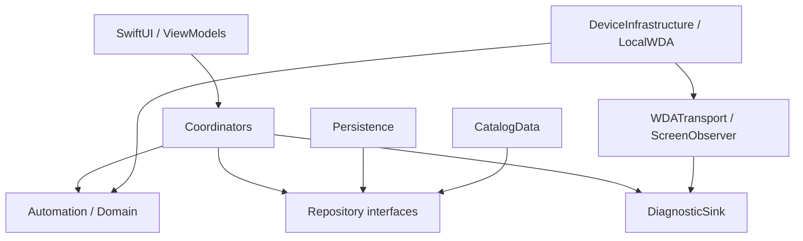

# LineDraw 模組化檢視

日期：2026-10-07。範圍：目前本機未提交版本，以 iOS 手機自主模式為主；Mac companion 僅檢查架構邊界。這是靜態檢視，未重新測速、建置、安裝或執行真實抽選。以下區分已確認的程式結構與尚待量測的效能影響。

## 結論

已有可保留的核心邊界，適合漸進拆分。首要工作是統一操作期限、分離持久化與診斷、縮小 UI 狀態更新範圍；單純搬檔不會使抽選變快。先在既有 target 內建立介面與責任邊界，再視需要拆 SwiftPM targets。

## 現況

- SwiftUI Views → AppModel：清單、設定、同步、配對、Mac 模式、手機批次、測試入口共用一個 ObservableObject。
- AppModel → DeviceBatch → DeviceDriver：已有依賴反轉；DeviceBatch 可注入 read/write、clock、sleep，方便測試。
- LocalWDA 實作 DeviceDriver：同時處理 HTTP、session、畫面查詢、OCR、導航、點擊驗證與診斷。
- DeviceRuntime：Rust bridge 啟停、背景工作、進度回報；同檔 DeviceSecrets 管理 Keychain 與 DDI 匯入。
- LineDrawCore：同一 target 包含模型、規則、儲存、HTML 解析、網路與測試資料；依賴 SwiftSoup。
- ios-wda：另有 JavaScript 引擎。跨語言規則應以共同測試案例維持一致，不宜直接強行共用實作。

## 優先發現

### 1. 高：逾時預算分散，外層期限無法限制正在進行的讀取

證據：`Core/Sources/LineDrawCore/DeviceBatch.swift:105` 每次載入設 30 秒期限，讀取完成後才檢查；`Core/Sources/LineDrawCore/WDARequestExecutor.swift:31` 自訂 source 18+12 秒、activeAppInfo 12+8 秒。`App/LocalWDA.swift:127` 傳入的前景查詢 3 秒值會被底層覆蓋；targeted 失敗又可能進入完整讀取。

結果：多層讀取與重試可能跨過外層期限，使用者所見的單筆時間不等於 30 秒。現有程式會在慢讀取結束後阻止超時點擊，這項保護應保留。

建議：建立 OperationBudget，由批次傳遞絕對期限至 observation、transport；每次重試與 fallback 先檢查剩餘預算。唯讀查詢可有界重試，點擊回應不明仍不得重送。加入慢讀取、期限耗盡、取消測試。

### 2. 高：同步儲存與診斷共用主執行緒和完整快照

證據：`App/AppModel.swift:5` 為 MainActor；`Core/Sources/LineDrawCore/Database.swift:15` 的 update 同步編碼並原子寫入整份快照。log 也呼叫 update。`App/AppModel.swift:271` 起逐筆寫診斷，每筆再重寫快照。

結果：這些呼叫會佔用 UI 主執行緒；資料量與診斷量增加時有造成卡頓的風險。本次未量測，不能把所有卡頓直接歸因於此。

建議：分出 ParticipationRepository、CatalogRepository、DiagnosticSink。先將診斷批量保存，再將持久化放入序列化 actor。抽選意圖必須 await 確實落盤後才能點擊；不能用延遲寫入換取速度而破壞防重送。Repository 需配合 DeviceBatch 非同步持久化介面，不只是搬檔。

### 3. 中：AppModel 承擔過多流程與 UI 狀態

證據：`App/AppModel.swift` 448 行；同時擁有 LocalDatabase、CatalogNetwork、CompanionClient、DeviceRuntime、DeviceBatch 與多個 Task。292–444 行主要是 Debug 速度測試／複查。清單等 View 訂閱同一個 ObservableObject。

結果：流程難以獨立替換與測試，批次進度更新會使共用訂閱者失效。data/now 更新也清除 CatalogPresentation cache；這不代表每次勾選都重新計算，先前選取快取修正仍有效。

建議：拆 CatalogViewModel（筛選、選取）、BatchCoordinator（開始／暫停／停止）、PairingCoordinator、CompanionCoordinator、DebugProbeService。AppModel 保留依賴組装與頂層狀態，讓各畫面只訂閱所需狀態。

### 4. 中：LocalWDA 將傳輸、辨識與操作政策混在一起

證據：`App/LocalWDA.swift` 374 行；request:60、targetedCapture:158、fullCapture:209、OCR 約 274、dispatchURL:321、validatedTap:355。

結果：一個錯誤在傳輸層先被記成失敗，再由上層恢復；目前診斷無法清楚區分「短暫失敗已恢復」與「批次終止」。前景辨識與 fixture 瀏覽器差異也容易混入同一路徑。

建議：拆 WDATransport、ForegroundResolver、ScreenObserver、OCRRecognizer；保留 LocalWDA 作為 DeviceDriver adapter。DiagnosticSink 記錄 batch/item/operation 與 recovered/fatal outcome。抽出 OCR 時需保留現有執行緒行為並另行驗證，不能因類別有 MainActor 就推論所有內部工作必定阻塞。

### 5. 中：Core 邊界過寬，平台服務仍與領域邏輯同包

證據：`Core/Package.swift:3` 僅一個 target；`Catalog.swift` 同檔含排程解析、HTML 解析、網路與 TestCatalog。

建議：先建立 Domain（模型、資格、紀錄狀態）、Automation（批次、導航與畫面規則）、CatalogData（網路與解析）、Persistence、DeviceInfrastructure 等邏輯目錄。Domain 不依賴 SwiftUI、UIKit、WDA 或 SwiftSoup。測試與 Debug fixture 明確分開；有產品用途的內建測試清單不能直接移除。

## 建議依賴方向

具體實作由 App 的組裝入口注入。既有 DeviceDriver、DeviceNavigationGuard、CatalogPresentation 與防重送測試應保留。

## 執行順序及驗收

1. 建立基準：分開记录 fixture 與真實 LINE；記每筆開頁、前景查詢、元素查詢、OCR、點擊、儲存與恢復次數，保留耗時分布。
2. 抽出 DiagnosticSink／DebugProbeService，先不改抽選行為；驗收診斷仍可追溯、正常 Release 無測試入口。
3. 抽出 transport 與統一期限；驗收剩餘期限限制、短暫 stale 恢復、取消不再派送、未知點擊不重送。
4. 拆 Repository 與 UI ViewModel；驗收 1,500 筆選取／滾動、背景保存、寫入失敗不點擊、重啟後 INTENT 轉 REVIEW。
5. 最後再拆 package targets，保持單向依賴並執行 Core 測試與 App Debug/Release 建置。真實抽選速度須另作實機驗收，離線測試不可替代。

本次只新增此報告，未改動 App 執行邏輯或手機上的版本。
