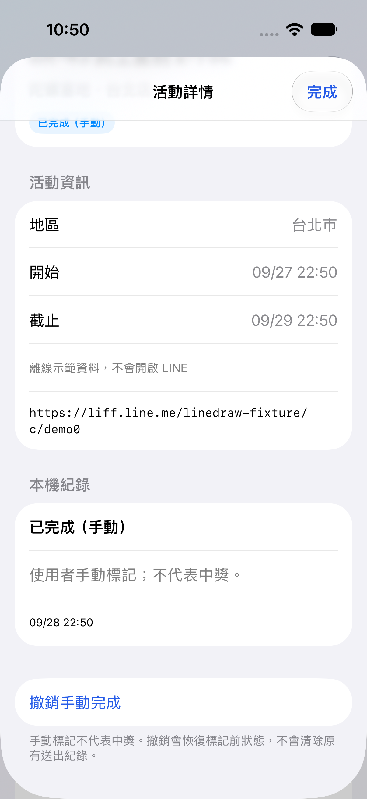
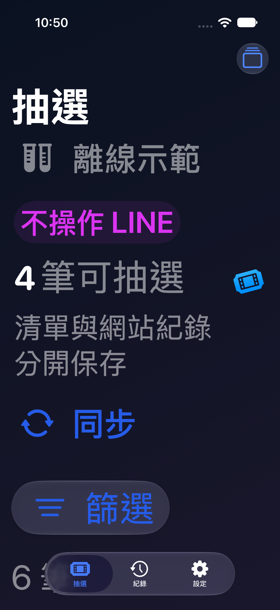

# LineDraw 原生 iPhone 1.0.0-alpha 驗證

日期：2026-09-28；本輪實作範圍為原生 App、Mac companion、文件與非商業來源發行。Android 與網站未修改。

## 已完成

| 檢查 | 結果 | 證據 |
|---|---|---|
| iOS Simulator 建置與 XCUITest | 4/4 通過；iOS 27、專用 LineDraw_Native_Lab | `.runtime/NativeUITests-final.xcresult`、`.runtime/ui-tests-final.log` |
| Swift Core | 22/22 通過 | `.runtime/core-tests.log` |
| Mac Node | 63/63 通過 | `../../ios-wda/.runtime/native-tests.log` |
| Mac 控制台 Playwright | 2/2 通過，獨立 4790 與測試資料目錄 | `../../ios-wda/.runtime/native-dashboard-tests.log` |
| iPhone arm64 建置 | unsigned Debug build 成功 | `.runtime/device-build.log` |
| 來源網站讀取 | HTTP 200，解析 893 筆、17 地區、795 筆具起訖時間；抽查一筆短網址可解析至 LIFF | `.runtime/website-snapshot.html`；未送出抽選 |
| 原型既有紀錄 | 15 筆，更新控制台前後 records SHA-256 相同 | `.runtime/original-records-hash`；備份在 Mac `.data` |
| 新控制台狀態 | 1.0.0-alpha、未連線、IDLE；4781 未監聽 | `/api/status` 與本機埠檢查 |

表中 `.runtime` 以 ios-app 目錄為基準，完整 logs 留在本機，不隨來源包發布。unsigned build 不能當可直接安裝的 IPA；實機需自行簽署。

## 測試涵蓋

- 台北 10:00 邊界、完整日期、星期與全形符號、未知時間、使用期限不誤當抽選截止。
- 來源順序、重複列／異常 HTML 保留舊清單、移除活動封存、暫時解析失敗保留既有身分。
- 地區與狀態多選、手動完成／撤銷保留原送出證據、設定檔與清單分區、資料原子寫入與損毀保護。
- 一次配對碼、有效期與錯誤次數、權杖撤銷、TLS 真實 socket、憑證指紋、拒絕瀏覽器 Origin／未配對請求。
- 凍結清單、來源順序與活動去重、重複 requestID 不重送、最多三輪接續、篩選與舊項目排除、五連結區不接續網站。
- 斷網等待有界、未知點擊狀態保留 REVIEW、略過保留不確定證據、停止能取消增量同步。
- 原生 UI：拒絕聲明不開功能、接受後進入、地區與狀態多選、手動標記與撤銷、離線示範跑完與紀錄、深色與最大輔助字體。
- 真實 iOS Liquid Glass 截圖已檢視；圖像是模擬器渲染，非設計稿。

## 本輪沒有驗證的部分

- **新原生 App → 區域網路 HTTPS 配對 → Mac → WDA → 真實 LINE** 的完整操作尚待實機驗收。TLS 測試的 driver 是 fixture，不操作手機；沒有宣稱與真實 iPhone 的 pinned URLSession 配對已通過。
- 先前 WDA 原型的 LINE 實機結果仍屬既有證據，不可替代新 App 整合驗收。本輪沒有重開真實手機 automation mode 或送出真實抽選。
- 全部 892 個不同來源短網址沒有逐一驗證；已驗證整頁 parser 與單筆 redirect。首輪同步可取消；失敗不清空既有資料。
- 真實 VoiceOver 朗讀順序、其他機型、iPad 畫面、背景切換後重連及長時間穩定性還需使用者裝置驗收。UI 已使用原生控制項與標籤，不能把這件事當作真人輔助使用測試已通過。
- 免電腦、TouchSynthesis、BGContinuedProcessingTask 尚未加入此版本。

## 下次實機驗收清單

1. 簽署安裝原生 App，確認首次聲明、相機／區域網路權限与 HTTPS 指紋配對成功。
2. 先同步與手動完成／撤銷，確認 Mac 和手機紀錄一致；換設定檔不沿用另一個 LINE 帳號紀錄。
3. 使用者明確開始後，以仍有效新測試活動執行小批；LINE 前景時從 Mac 停止；回到 App 取得進度。
4. 重開已中獎與未中獎活動，確認接續且不兌換。測試單獨加好友和合併按鈕。
5. 慢網路、拔線、Mac 中斷／重啟與 App 重開，確認無自動重送不確定操作。

## 原生畫面

