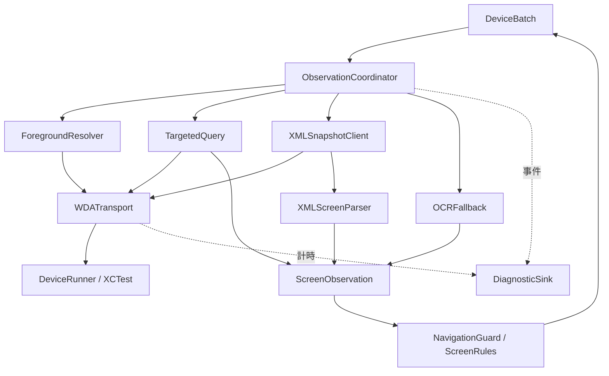

# LineDraw 畫面查詢與 XML 備援完整規格 v1

日期：2026-10-07。狀態：待實作設計，不代表目前 App 已符合本規格。範圍為 iPhone 自主模式的原生元素查詢、XML 備援與 OCR 交接；Mac companion、單 IPA 合併、清單同步及簽署不在本規格內。

## 1. 目標與證據

- 正常可辨識頁面優先用必要元素查詢；XML 是完整畫面備援，不能每次輪詢都重新取得。
- 每筆共用一個時間預算，禁止 transport、XML、OCR 各自延長外層期限。
- 保留新頁確認、前景驗證、操作意圖持久化與未知結果不重送。
- 最終效能目標為五筆操作總計不超過 3 秒；這是目標，不是目前可交付保證。
- 已有 Debug 離線實測為 14.93／17.35 秒；其中五次點擊請求已用 3.07／3.20 秒。XML/OCR 優化不能單獨證明達到目標。
- 現有無網址辨識路徑至少要求開頁後 0.5 秒、兩次相符觀察相隔 0.2 秒。這也是整輪速度限制；v1 保留，不為達標而直接刪除。

## 2. 現況與變更界線

| 項目 | 目前程式 | v1 設計 |
|---|---|---|
| 啟動入口 | DeviceBatch → LocalWDA.snapshot | Batch 傳入不可延長的 QueryContext |
| 快速讀取 | POST elements，4 秒 timeout | 遵守剩餘預算，保留必要情境 |
| XML | GET source，最多 18+12 秒 | 每次最多 4 秒；每筆至多 2 次，包含確認及重試 |
| 前景讀取 | 3 秒單次，最多一次重試 | 使用同一剩餘預算；不另建期限 |
| 備援條件 | 連續失敗／查詢成本比較 | 明確有限狀態機與錯誤分類 |
| 解析 | XMLParser → ScreenNode | 背景解析、完整性驗證、資源上限 |
| OCR | XML 後按條件裁切底部 40% | 獨立策略模組；先 25% 後 40% 待實測 |
| 診斷 | 部分總量與批次末彙整 | 每筆關聯 ID、分段耗時、恢復結果 |

數值均為第一版待驗證預設，不是 iOS 平台保證。逾時變短可能降低慢頁面的成功率，必須與成功率一起驗收。

## 3. 架構與責任



- DeviceBatch：持有每筆期限、順序、停止與參加紀錄；不解析 XML。
- ObservationCoordinator：選擇查詢策略、處理失效觀察、管理嘗試次數；不執行點擊。
- ForegroundResolver：回傳系統觀察到的宿主 App；不得以預期 LINE 身分填補 unknown。
- TargetedQuery：查詢必要元素；不能遺漏系統 Alert、登入阻擋、完整活動網址與畫面尺寸。
- XMLSnapshotClient：呼叫 GET source、驗證回應、交給解析器。
- WDATransport：session、HTTP、取消、回應大小及 request ID；不得自行增加重試次數。
- XMLScreenParser：純解析，輸出 Sendable 值，不呼叫網路、不寫紀錄、不點擊。
- OCRFallback：必要時補充文字候選；不單獨授權操作。
- DiagnosticSink：序列化記錄；統計寫入不得阻塞每筆查詢。操作意圖的持久化另走 Repository，必須等待完成。
- UI 僅訂閱進度，不持有 XML 或影像。

## 4. 資料契約

以下是介面草案，不是可直接編譯的完整實作：

```swift
struct QueryContext: Sendable {
    let batchID: UUID
    let itemID: UUID
    let navigationID: UUID
    let sessionGeneration: UInt64
    let expectedBundle: String
    let targetURL: String          // 僅供記憶體內比對，不寫一般診斷
    let deadline: ContinuousClock.Instant
}
struct ScreenObservation: Sendable {
    let observationID: UUID
    let navigationID: UUID
    let sessionGeneration: UInt64
    let startedAt: ContinuousClock.Instant
    let finishedAt: ContinuousClock.Instant
    let foregroundBundle: String
    let orientation: Orientation
    let source: ObservationSource // targeted / xml / xmlWithOCR
    let completeness: Completeness // complete / incomplete
    let screen: DeviceScreen
}
protocol ScreenObserving {
    func observe(context: QueryContext) async throws -> ScreenObservation
}
protocol XMLSnapshotFetching {
    func fetch(context: QueryContext) async throws -> Data
}
protocol XMLScreenParsing {
    func parse(_ xml: Data, limits: ParseLimits) throws -> ParsedScreen
}
```

期限用單調時鐘；展示時間使用 UTC 日期，介面依台灣時區呈現。不得用系統日期調整來延長 timeout。測試需注入 clock。

每個 navigationID 只屬於一次成功開頁要求。session 重建、旋轉、前景變更、導航、點擊與取消均使觀察或其操作資格失效。辨識來源變更不代表新頁已載入。

## 5. 查詢流程與狀態機

1. 檢查取消、session generation、剩餘期限。
2. 確認前景：不符則回傳等待／暫停原因，不讀該 App 的完整 XML；系統短暫過場可在原期限內等待。
3. 執行 targeted 查詢，分類為可判斷、資訊不足或明確錯誤。
4. 完整且可判斷的畫面送 NavigationGuard，不直接點擊。
5. stale element／短暫缺失最多在本次觀察重查一次，仍失敗才評估 XML。重查間隔 100ms，计入預算；不可擴散成每層各一次重試。
6. targeted 成功但資訊不足，首次先等待新觀察；同導航連續兩次不足才允許 XML。unsupported operation 可直接切 XML 並記住本 session 不支援。
7. XML 回應先驗證，再背景解析。完整性不符則不能拿已解析的部分節點操作。
8. XML 足以判斷則送 NavigationGuard；需要第二次穩定確認時，必須用新觀察，不能把同一份 cache 當第二次。
9. XML 仍不足且有可信活動情境、無阻擋、剩餘時間足夠時，才進 OCR。不得把格式錯誤或被截斷的 XML 當作「沒有阻擋」。
10. 預算耗盡或嘗試上限達到，停止本筆辨識並保存明確狀態；不可為了取得結果無限輪詢。

狀態：checkingForeground → targeted → evaluating → xml → evaluating → ocr → evaluating；任一步可到 cancelled、paused、deadlineExceeded、disconnected。策略以 policy value 注入，便於回歸與撤回。

## 6. 時間與資源預算

| 項目 | 初始設定 | 規則 |
|---|---:|---|
| 每筆從開頁至保存結果 | 30 秒 | v1 硬性截止；重開頁不重設 |
| 前景查詢 | 單次 3 秒 | 最多 2 次；由 coordinator 計數 |
| targeted 查詢 | 單次 4 秒 | 每筆最多 6 次，含 stale 重查 |
| XML 取得 | 單次 4 秒 | 每筆最多 2 次，含新鮮確認與重試 |
| XML 啟動門檻 | 剩餘至少 1 秒 | request timeout=min(4 秒, 剩餘時間) |
| OCR | 每筆最多 2 次 Vision 呼叫 | 25% 未命中可用同張影像擴至 40%；確認用的新影像亦計次 |
| XML 原文 | 小於 8 MB | 以 UTF-8 bytes 計，不是字元數 |
| HTTP 解碼後 JSON body | 小於 12 MB | 必須在接收中限流，不能只在讀完才檢查 |
| XML 節點 | 最多 20,000 | 超限為 incomplete，不授權點擊 |
| XML 深度 | 最多 64 | 與 Runner snapshotMaxDepth=50 分開管理 |
| 單一屬性值 | 最多 64 KiB | 超限拒絕，不靜默截斷關鍵文字 |

30 秒為恢復上限，並非每筆刻意等待。3 秒為完整成功輪次效能目標，不能用「3 秒截止然後跳過全部」達成。

URLSession timeout 不保證精準牆鐘截止；另設 deadline watcher 取消 URLSessionTask。取消後晚到回應必須丟棄。Runner 端可能仍在處理已取消查詢，此時不得盲目派送第二個同 session 查詢；先確認 session 可回應，否則結束本輪。取消本機等待不等於遠端工作已取消。

同步 XMLParser 要在 delegate 中檢查資源限制／取消旗標並 abortParsing；OCR 的原生取消若不能立即生效，結果仍需經 navigation/session generation 驗證，不得回填下一筆。

## 7. WDA 與 XML 介面

- Endpoint：GET /session/{sessionID}/source，唯讀。保留目前 WDA 契約，不自創「局部 XML」參數。
- 正常：2xx 且 JSON value 為非空 XML 字串。
- HTTP 404 必須依 WDA error code 區分 stale element 與 invalid session，不能一律重試。
- 拒絕非預期重導、非 JSON、缺 value、非字串 value、回應過大。
- 每個 session 僅一個畫面查詢在途；禁止 XML 與 targeted 並行搶 XCTest。
- v1 不改 WDA 元素樹生成方式。未來若要減少 Runner 端遍歷，需另立 endpoint、版本協商、相同畫面結果對照測試；僅在 App 端過濾節點不能節省遠端生成成本。

## 8. XML 解析與判斷

必留資料：Application 尺寸、Alert、WebView 活動網址、活動標題／情境、登入驗證提示、操作按鈕、已參加／已結束／結果文字。

節點含 type、label/name/value 去重後文字、x/y/width/height、enabled、visibility。位置單位為螢幕邏輯點，OCR 像素須映射；不能混用。

- 拒絕 DOCTYPE、ENTITY，關閉外部 entity 解析，解析器不存取檔案或網路。
- 必須完整解析結束，不能接受半份 XML。
- Application 幾何必須唯一且有效，座標有限、尺寸為正；缺少必要 enabled/visibility 不得猜為可點擊。
- 可見性必須考慮祖先。保留現有 WebView 空白不可存取 wrapper 特例及測試，不能直接忽略所有 invisible 父節點。
- 未識別 tag 可遍歷子元素；未知關鍵欄位讓該觀察不具操作資格。
- disabled 結果文字仍可用於判斷終態，不能當點擊候選。
- 多個操作候選、Alert、登入／驗證等情況暫停，不自行選第一個。
- 「使用優惠券」等兌換控制不得加入抽選點擊白名單。

## 9. 新頁確認與快取

證據分級：
1. document：可見活動 URL 與目标完整相符。
2. settled：網址未提供，但開頁後得到兩次相符的新觀察，至少經過 0.5 秒，兩次相隔至少 0.2 秒。這只是穩定畫面啟發式，不證明活動身分。
3. unverified：不足以通過。

明確不同的活動 URL 必須拒絕，不得退回 settled。v1 沿用現有 settled 政策並明確記錄其限制；如需保證活動身分，應另改成只接受 document 或可信的活動專屬標記，不能宣稱現況已做到。

快取僅限同 navigationID、session generation、方向與尺寸。原生觀察最多 1.5 秒可供現有點擊驗證重用；不得用它重複計入穩定觀察。OCR 結果短暫快取上限 1 秒，且前景／影像區域必須匹配；不能只靠相同 AX 文字判定影像未改變。點擊前維持新的前景檢查。

## 10. OCR 交接

OCR 必須收到 QueryContext、相同導航的新截圖、尺寸／方向、活動情境及阻擋狀態。

先底部 25%，未命中才擴至底部 40%，只在剩餘次數和時間允許時進行。比例需用不同手機、安全區、結果 sheet 實測，未通過前保留 40% 預設。保留 accurate 辨識作基線，fast 模式須證明繁體中文識別率才可替换。

分開量測 screenshot roundtrip、base64/image decode、crop、Vision、classification。快取失效、信心不足或目標歧義都不能點擊；沒有 OCR 結果不代表活動結束。

## 11. 錯誤與恢復

| 原因 | 行為 | 重送點擊 |
|---|---|---|
| stale/no such element，唯讀查詢 | 有界取得新觀察 | 不涉及 |
| XML 查詢 timeout | 剩餘預算及次數允許才重查 | 不涉及 |
| invalid session / runner lost | 停止本輪，要求重新連線 | 禁止 |
| malformed/oversized/incomplete XML | 丟棄；有預算可重新取得一次 | 禁止以部分資料點擊 |
| 前景錯誤／未知 | 不讀外部 App XML，等待或暫停 | 禁止 |
| 明確不同活動 | 保留 pending，期限耗盡結束本筆 | 禁止 |
| 使用者停止 | 取消未完成查詢，拒收晚到結果 | 禁止 |
| 意圖保存失敗 | 結束操作、顯示儲存錯誤 | 禁止 |
| 點擊已派送但回應不明 | 紀錄 REVIEW，停止本輪 | 禁止 |
| 本筆預算耗盡 | 紀錄 LOAD_TIMEOUT，依既有批次政策接下一筆 | 禁止本筆繼續 |

暫時查詢失敗和批次終止使用不同事件；恢復成功需有 readRecovered 事件，避免單一 WDA_REQUEST_FAILED 讓使用者誤以為整輪失敗。

## 12. 診斷規格

每個事件：schemaVersion、batchID、itemID、navigationID、operationID、strategy、attempt、elapsedMs、remainingMs、responseBytes、nodeCount、outcome、errorCode、recovered。

每筆彙整：openMs、foregroundMs、targetedMs、xmlRequestMs、xmlParseMs、screenshotMs、ocrMs、tapValidateMs、tapDispatchMs、persistenceMs、waitMs、totalMs、最終狀態。

時間層級必須明確：total 包含子階段，禁止相加重複計算；XML request 包含遠端取得、生成與傳輸，若 Runner 未提供內部計時就不能假裝已拆分。新增 cancelledInFlight 與 lateResultDiscarded 計數。

正常日誌不存原始 XML、截圖、完整 URL、session token、聊天文字；以隨機 itemID 關聯。保留既有 30 天／300 筆策略時採每筆彙整而非每個輪詢落盤，避免事件把有效紀錄擠掉。詳細原始證據限明確啟用的 Debug 離線 fixture。

## 13. 測試與驗收

單元測試：
- 正常按鈕、disabled 終態、不同網址、相同文字舊頁、Alert、多候選、登入阻擋。
- 半份 XML、DOCTYPE/ENTITY、深度與大小超限、非有限座標、缺欄位、wrapper 可見性。
- targeted stale 後恢復、unsupported 切 XML、XML 次數耗盡、重試共用期限。
- XML/targeted 切換不誤判新頁；cache 不充當第二次觀察。
- 停止期間晚到結果丟棄；session/方向/導航改變使結果失效。
- 意圖未落盤不派送；未知點擊結果不重送。

整合測試：可控制延遲的本機 transport stub，驗證取消、唯一在途、慢回應、畸形 response。測試 transport timeout 與總 deadline 不混淆。Runner 必須加相容性測試，不能只測 Swift。

實機：修改前後同機型、同版本、同網路、相同 fixture，各至少三輪五筆；記啟動另計、操作總計、每筆耗時、median/max、策略次數、成功率及 ack 次數。真實 LINE 先唯讀驗證，再以使用者選定活動量測，不拿已抽終態的略過當成功抽選速度。

通過標準：
- 回歸测试全通過；每筆成功操作 ack 一次，錯前景／舊頁／歧義無點擊。
- 不因縮短 timeout 顯著降低成功率；對照出現新的失敗即先調查，不用較少完成數換快。
- 保持正常路徑 XML 次數為 0；需要 XML 的測試不得偷偷不測。
- 三輪離線五筆皆 ≤3 秒、5/5 且各 ack 一次，才稱「離線達標」；真實 LINE 另行驗收。
- 未達效能目標可交付已驗證修正，但必須標示未達標，不把啟動／儲存／重試隱藏在計時之外。

## 14. 實作順序與交付

1. 加入完整分段觀測，先不改查詢策略。
2. 抽出 XMLScreenParser／XMLSnapshotClient，保留原測試並加限制測試。
3. 導入 QueryContext、唯一在途與取消世代檢查。
4. 導入共用 deadline，再改有界 fallback 策略。
5. 導入 OCR 交接與裁切實驗；未驗證前保持原比例。
6. 實機比較與 Release build；更新 IPA 及版本紀錄。

預計檔案：Core 新增 ObservationModels、ObservationPolicy、XMLScreenParser；App 新增 ObservationCoordinator、XMLSnapshotClient、DiagnosticSink；LocalWDA 逐步成為 DeviceDriver adapter；DeviceBatch 增加 context/deadline 傳递。不要一次把所有類別改寫，也不要同時改簽署、單 IPA 或清單同步。

每階段独立 diff 與測試證據。以可注入 policy 保留舊查詢策略供回歸比較，但不得恢復跨導航快取、未知點擊自動重送或無界等待。完整交付含原始碼、測試、實機報告、IPA、Runner 版本及限制說明。
